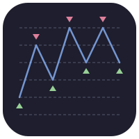

<p align="center">
  
</p>

<h1 align="center">Grid Trading Bot</h1>

<p align="center">
  <strong>Backtest. Paper trade. Go live.</strong><br/>
  A modular Python engine for crypto grid trading with real-time Grafana monitoring.
</p>

<p align="center">
  
  
</p>

<p align="center">
  <a href="https://github.com/jordantete/grid_trading_bot/actions/workflows/unit_tests.yml"></a>
  <a href="https://codecov.io/github/jordantete/grid_trading_bot"></a>
  <a href="https://pypi.org/project/grid-trading-bot/"></a>
  <a href="https://jordantete.github.io/grid_trading_bot/"></a>
</p>

<p align="center">
  <a href="https://jordantete.github.io/grid_trading_bot/">Documentation</a> &nbsp;&bull;&nbsp;
  <a href="https://jordantete.github.io/grid_trading_bot/quick-start/">Quick Start</a> &nbsp;&bull;&nbsp;
  <a href="https://jordantete.github.io/grid_trading_bot/configuration/config-file/">Configuration</a> &nbsp;&bull;&nbsp;
  <a href="https://jordantete.github.io/grid_trading_bot/concepts/grid-trading/">Grid Trading Concepts</a> &nbsp;&bull;&nbsp;
  <a href="https://jordantete.github.io/grid_trading_bot/monitoring/setup/">Monitoring</a> &nbsp;&bull;&nbsp;
  <a href="https://jordantete.github.io/grid_trading_bot/contributing/guide/">Contributing</a>
</p>

---

## How It Works

Define a price range and number of grid levels. The bot places layered buy and sell orders across the range, capturing profit from every price oscillation — no prediction needed.

1. **Configure** your grid (pair, range, levels, spacing) in a single JSON file
2. **Backtest** against historical data to validate the strategy
3. **Paper trade** on exchange sandboxes with real market data
4. **Go live** with crash recovery, real-time monitoring, and alerts

## Features

|                           |                                                                                 |
| ------------------------- | ------------------------------------------------------------------------------- |
| **Backtesting**           | Simulate strategies on historical OHLCV data (CSV or fetched via CCXT)          |
| **Paper Trading**         | Test against real market data using exchange sandbox APIs                       |
| **Live Trading**          | Execute real trades with retry logic, exponential backoff, and circuit breakers |
| **Grid Strategies**       | Simple grid and hedged grid with arithmetic or geometric spacing                |
| **Risk Management**       | Configurable take-profit, stop-loss, and slippage controls                      |
| **Performance Analytics** | ROI, max drawdown, Sharpe ratio, interactive Plotly charts                      |
| **Crash Recovery**        | SQLite state persistence with exchange reconciliation on restart                |
| **Monitoring**            | Grafana dashboards with Loki log aggregation via Docker Compose                 |
| **Notifications**         | Alerts via Apprise (Telegram, Discord, Slack, email, and 80+ services)          |
| **Multi-Exchange**        | Any exchange supported by CCXT (Binance, Kraken, Bybit, ...)                    |

## Tech Stack

- **Python 3.12+** with `asyncio` — async-first event-driven architecture
- **CCXT / CCXT Pro** — unified exchange API with WebSocket support
- **SQLite (WAL mode)** — lightweight crash-recovery persistence
- **Plotly** — interactive backtest result visualization
- **Grafana + Loki + Alloy** — real-time log monitoring stack
- **uv** — fast Python package management

## Quick Start

### Prerequisites

- Python 3.12+
- [uv](https://docs.astral.sh/uv/) package manager

### Setup

```bash
# Clone and install
git clone https://github.com/jordantete/grid_trading_bot.git
cd grid_trading_bot
uv sync --all-extras --dev

# Run a backtest
uv run grid_trading_bot run --config config/config.json
```

### Docker Monitoring (optional)

```bash
# Start Grafana + Loki + Alloy
docker-compose up -d
```

## Documentation

> **[Full documentation](https://jordantete.github.io/grid_trading_bot/)** — Installation, configuration, CLI usage, monitoring, architecture, and more.

| Resource                                                                                      | Description                             |
| --------------------------------------------------------------------------------------------- | --------------------------------------- |
| [Quick Start](https://jordantete.github.io/grid_trading_bot/quick-start/)                     | Install and run your first backtest     |
| [Configuration](https://jordantete.github.io/grid_trading_bot/configuration/config-file/)     | Full `config.json` parameter reference  |
| [Grid Trading Concepts](https://jordantete.github.io/grid_trading_bot/concepts/grid-trading/) | Understand grid trading strategies      |
| [Monitoring Setup](https://jordantete.github.io/grid_trading_bot/monitoring/setup/)           | Set up Grafana dashboards for live bots |
| [Architecture](https://jordantete.github.io/grid_trading_bot/architecture/overview/)          | Codebase design and patterns            |
| [Contributing](https://jordantete.github.io/grid_trading_bot/contributing/guide/)             | Help improve the project                |

## License

This project is licensed under the [MIT License](./LICENSE.txt).

## Disclaimer

This project is intended for educational purposes only. The authors and contributors are not responsible for any financial losses incurred while using this bot. Trading cryptocurrencies involves significant risk and can result in the loss of all invested capital. Please do your own research and consult with a licensed financial advisor before making any trading decisions. Use this software at your own risk.
