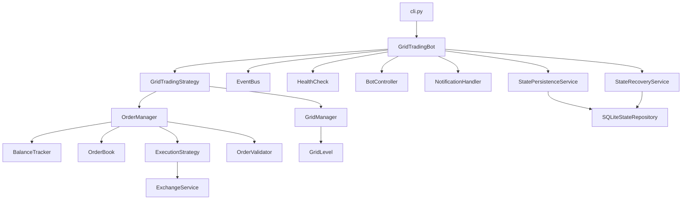
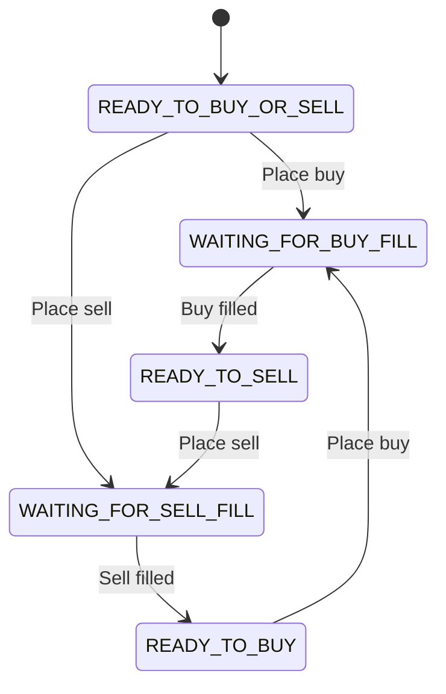

# Architecture Overview

The Grid Trading Bot follows a modular, event-driven architecture with clear separation of concerns.

## Package Layout

The project uses a **src layout**:

```
src/grid_trading_bot/
├── cli.py                          # Click CLI entry point
├── __main__.py                     # python -m support
├── core/
│   ├── bot_management/             # Bot lifecycle & orchestration
│   │   ├── grid_trading_bot.py     # Main orchestrator
│   │   ├── event_bus.py            # Pub/sub event system
│   │   ├── bot_controller.py       # Runtime CLI commands
│   │   ├── health_check.py         # System monitoring
│   │   └── notification_handler.py # Apprise alerts
│   ├── grid_management/            # Grid computation & state
│   │   ├── grid_manager.py         # Level calculation
│   │   └── grid_level.py           # Level state machine
│   ├── order_handling/             # Order lifecycle
│   │   ├── order_manager.py        # Order orchestration
│   │   ├── balance_tracker.py      # Fiat/crypto balances
│   │   ├── order_book.py           # Order-to-grid mapping
│   │   └── execution_strategy/     # Backtest vs live execution
│   ├── persistence/                # State persistence (live mode)
│   │   ├── state_persistence_service.py  # Event-driven checkpoints
│   │   ├── state_recovery_service.py     # Merge recovery on restart
│   │   ├── sqlite_state_repository.py    # SQLite backend
│   │   └── serializers.py                # Model serialization
│   ├── services/                   # Exchange abstraction
│   │   ├── backtest_exchange_service.py
│   │   └── live_exchange_service.py
│   └── validation/                 # Order validation
├── strategies/                     # Trading strategies
│   ├── grid_trading_strategy.py    # Main strategy logic
│   ├── trading_performance_analyzer.py
│   └── plotter.py                  # Plotly visualization
├── config/                         # Configuration management
│   ├── config_manager.py
│   ├── config_validator.py
│   └── trading_mode.py
└── utils/                          # Logging, I/O helpers
```

## Module Dependencies



## Design Patterns

### Factory Pattern

Two factories select implementations based on the configured `TradingMode`:

- **`ExchangeServiceFactory`** — Returns `BacktestExchangeService` or `LiveExchangeService`
- **`OrderExecutionStrategyFactory`** — Returns instant (backtest) or retrying (live) execution

### Event Bus

Decoupled communication via a publish/subscribe system. Components subscribe to events rather than calling each other directly.

| Event | Published When | Typical Subscribers |
|-------|---------------|-------------------|
| `ORDER_FILLED` | An order is fully executed | OrderManager, BalanceTracker, StatePersistenceService |
| `ORDER_CANCELLED` | An order is cancelled | OrderManager, StatePersistenceService |
| `START_BOT` | Bot initialization complete | BotController |
| `STOP_BOT` | Shutdown requested | All components |
| `INITIAL_PURCHASE_DONE` | Initial crypto purchase completed | StatePersistenceService |
| `GRID_ORDERS_INITIALIZED` | Grid orders placed for the first time | StatePersistenceService |

### State Machine

Each `GridLevel` transitions through `GridCycleState` as orders are placed and filled:



### Strategy Pattern

`TradingStrategyInterface` defines the ABC. `GridTradingStrategy` implements it with two execution modes:

- **Backtest mode** — Iterates over OHLCV rows synchronously
- **Live/Paper mode** — Consumes a WebSocket price stream asynchronously

The strategy handles:

1. Initial purchase (50% allocation of initial balance)
2. Grid order initialization across computed levels
3. Order fill handling (buy fill → place sell above, sell fill → place buy below)
4. Take-profit and stop-loss monitoring

## Trading Modes

| Mode | Exchange Service | Execution Strategy | Additional Tasks |
|------|-----------------|-------------------|-----------------|
| `backtest` | `BacktestExchangeService` (CSV/CCXT OHLCV) | Instant fill | None |
| `paper_trading` | `LiveExchangeService` (sandbox APIs) | Retry with backoff | BotController, HealthCheck |
| `live` | `LiveExchangeService` (production APIs) | Retry with backoff | BotController, HealthCheck, StatePersistence, ReconciliationService |

In live and paper modes, the bot runs three concurrent async tasks:

1. **Trading strategy** — Price consumption and order management
2. **BotController** — Runtime CLI commands for status and control
3. **HealthCheck** — System resource monitoring (CPU, memory)

## State Persistence (Live Mode Only)

In live trading mode, the bot persists its state to a SQLite database so it can recover from crashes or restarts without losing order history, grid states, or balance tracking.

### How It Works

- **Checkpoint strategy**: Event-driven — a full snapshot is written after every `ORDER_FILLED`, `ORDER_CANCELLED`, `INITIAL_PURCHASE_DONE`, and `GRID_ORDERS_INITIALIZED` event
- **Database**: SQLite with WAL (Write-Ahead Logging) mode for crash safety
- **DB path**: `data/{BASE}_{QUOTE}/state_{config_hash[:8]}.db` (auto-derived, or explicit via `persistence.db_path` in config)

### Recovery on Restart

When the bot starts in live mode with an existing state DB:

1. **Config compatibility** — Compares config hash; if grid configuration changed, clears DB and starts fresh
2. **Grid level restoration** — Overlays saved states and paired-level references onto freshly computed grid levels
3. **Order restoration** — Reconstructs Order objects from DB, repopulates the OrderBook
4. **Exchange reconciliation** — For each locally-open order, fetches current status from exchange:
    - Filled while bot was down → updates status locally
    - Canceled on exchange → releases reserved funds
    - Not found → marks as ghost, releases funds
    - Orphan orders on exchange (not in local book) → logged as warnings, not auto-adopted
5. **Balance restoration** — Exchange balance is authoritative; DB reserved amounts are overlaid

### Configuration

```json
{
  "persistence": {
    "enabled": true,
    "db_path": "data/SOL_USDT/my_state.db"
  }
}
```

Both fields are optional. Persistence is enabled by default in live mode. The `db_path` defaults to `data/{BASE}_{QUOTE}/state_{hash}.db` where `{hash}` is derived from the grid configuration, ensuring different grid configs get separate databases even for the same trading pair
