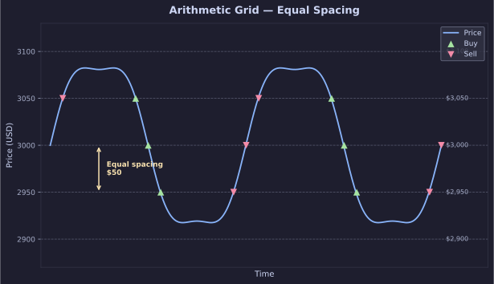
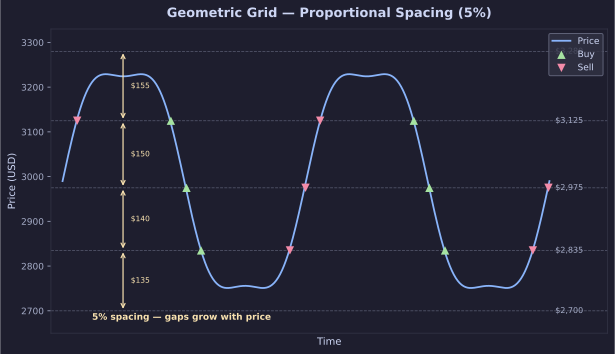
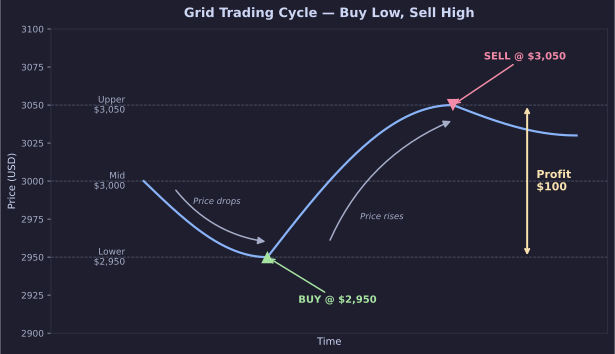
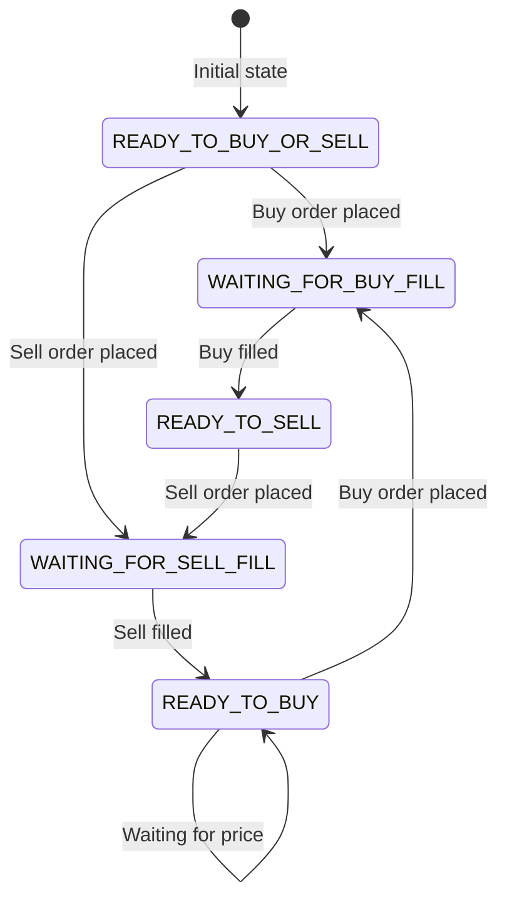

# Grid Trading Concepts

Grid trading is a strategy that places buy and sell orders at predefined intervals above and below a set price. The goal is to capitalize on market volatility by buying low and selling high at different price points.

## Grid Spacing Types

### Arithmetic Grid

In an arithmetic grid, price levels are spaced **equally**. The distance between each level is constant.

**Example** — Price at $3,000 with $50 spacing:

| Level | Price |
|-------|-------|
| 5 | $3,100 |
| 4 | $3,050 |
| 3 | $3,000 (current) |
| 2 | $2,950 |
| 1 | $2,900 |

Best for assets with **stable, linear** price fluctuations.



### Geometric Grid

In a geometric grid, price levels are spaced **proportionally** by a percentage. Intervals grow or shrink exponentially.

**Example** — Price at $3,000 with 5% spacing:

| Level | Price |
|-------|-------|
| 5 | $3,280 |
| 4 | $3,125 |
| 3 | $2,975 |
| 2 | $2,835 |
| 1 | $2,700 |

Best for assets with **significant, unpredictable volatility** and exponential price movements.



### When to Use Each Type

| Criteria | Arithmetic | Geometric |
|----------|-----------|-----------|
| Market behavior | Ranging, stable | Trending, volatile |
| Level distribution | Uniform spacing | Wider at extremes |
| Risk profile | Lower per trade | Adapts to swings |

## Grid Strategies

### Simple Grid

Independent buy and sell grids. Each grid level operates standalone — profits from each level are independent.

- Buy orders placed below the current price
- Sell orders placed above the current price
- When a buy fills, a corresponding sell is placed one level above
- When a sell fills, a corresponding buy is placed one level below



### Hedged Grid

Dynamically pairs buy and sell levels, balancing risk and reward. Better suited for higher volatility markets where coordinated position management is needed.

## Grid Level Lifecycle

Each grid level follows a state machine through its trading cycle:



**States:**

| State | Description |
|-------|-------------|
| `READY_TO_BUY_OR_SELL` | Initial state — level can accept either a buy or sell order |
| `READY_TO_BUY` | Level is ready for a buy order |
| `WAITING_FOR_BUY_FILL` | Buy order placed, waiting for execution |
| `READY_TO_SELL` | Buy filled — level is ready for a sell order |
| `WAITING_FOR_SELL_FILL` | Sell order placed, waiting for execution |

## Configuration

Configure grid strategy in your `config.json`:

```json
{
  "grid_strategy": {
    "type": "simple_grid",
    "spacing": "geometric",
    "num_grids": 8,
    "range": {
      "top": 200,
      "bottom": 250
    }
  }
}
```

See the [full configuration reference](../configuration/config-file.md) for all available parameters.
