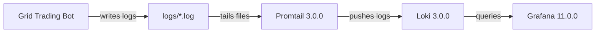

# Monitoring Setup

The project includes a Docker Compose stack for centralized log monitoring using **Grafana**, **Loki**, and **Promtail**.

## Architecture



## Prerequisites

- [Docker](https://docs.docker.com/get-docker/) and Docker Compose installed
- A `.env` file with Grafana credentials (see [Environment Variables](../configuration/environment-variables.md))

## Start the Stack

```bash
docker-compose up -d
```

This starts three services:

| Service | Image | Port | Purpose |
|---------|-------|------|---------|
| **Loki** | `grafana/loki:3.0.0` | 3100 | Log aggregation and storage |
| **Grafana** | `grafana/grafana:11.0.0` | 3000 | Visualization and dashboards |
| **Promtail** | `grafana/promtail:3.0.0` | 9080 | Log collection agent |

## Access Grafana

1. Navigate to [http://localhost:3000](http://localhost:3000)
2. Log in with the credentials from your `.env` file:
    - **Username**: value of `GRAFANA_ADMIN_USER` (default: `admin`)
    - **Password**: value of `GRAFANA_ADMIN_PASSWORD`

Loki is pre-configured as the default datasource.

## Log Pipeline

### How Promtail Processes Logs

Promtail tails all `.log` files from the `logs/` directory and extracts structured labels from the log filenames.

**Labels extracted from filename:**

| Label | Example | Description |
|-------|---------|-------------|
| `base_currency` | `SOL` | Base currency of the trading pair |
| `quote_currency` | `USDT` | Quote currency of the trading pair |
| `trading_mode` | `backtest` | Trading mode (backtest/paper_trading/live) |
| `strategy_type` | `simple_grid` | Grid strategy type |
| `spacing_type` | `geometric` | Grid spacing type |
| `grid_size` | `8` | Number of grid levels |
| `grid_range` | `120-200` | Grid price range |

A derived `trading_pair` label is created by combining `base_currency/quote_currency` (e.g., `SOL/USDT`).

### Log Format Parsing

Promtail parses each log line to extract:

- **Timestamp** — Used for time-series indexing in Loki
- **Service** — The component that emitted the log
- **Level** — Log severity (DEBUG, INFO, WARNING, ERROR)
- **Message** — The log content

## Alert Rules

Two alert rules are pre-configured in Loki:

| Alert | Condition | Severity | Description |
|-------|-----------|----------|-------------|
| **HighCPUUsage** | CPU > 80% for 2+ minutes | Warning | Fires when the bot's CPU usage exceeds 80% |
| **OrderExecutionFailure** | > 3 failures in 5 minutes | Critical | Fires on repeated order execution failures |

Alert rules are defined in `monitoring/configs/loki/rules.yaml`.

## Configuration Files

| File | Purpose |
|------|---------|
| `docker-compose.yml` | Service definitions and volumes |
| `monitoring/configs/loki/loki.yaml` | Loki storage, limits, and cache settings |
| `monitoring/configs/loki/rules.yaml` | Alert rule definitions |
| `monitoring/configs/promtail/promtail.yaml` | Log tailing and label extraction |
| `monitoring/configs/grafana/provisioning/datasources.yml` | Loki datasource auto-provisioning |
| `monitoring/configs/grafana/provisioning/dashboards.yml` | Dashboard auto-provisioning |

## Stop the Stack

```bash
docker-compose down
```

To also remove stored data:

```bash
docker-compose down -v
```
