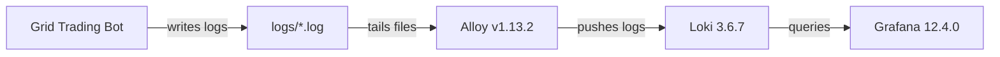

# Monitoring Setup

The project includes a Docker Compose stack for centralized log monitoring using **Grafana**, **Loki**, and **Alloy**.

## Architecture


```mermaid
flowchart LR
    Bot["Grid Trading Bot"] -->|writes logs| Logs["logs/*.log"]
    Logs -->|tails files| Alloy["Alloy v1.13.2"]
    Alloy -->|pushes logs| Loki["Loki 3.6.7"]
    Loki -->|queries| Grafana["Grafana 12.4.0"]
```

## Prerequisites

- [Docker](https://docs.docker.com/get-docker/) and Docker Compose installed
- A `.env` file with Grafana credentials (see [Environment Variables](../configuration/environment-variables.md))

## Start the Stack

```bash
docker-compose up -d
```

This starts three services:

| Service | Image | Port | Purpose |
|---------|-------|------|---------|
| **Loki** | `grafana/loki:3.6.7` | 3100 | Log aggregation and storage |
| **Grafana** | `grafana/grafana:12.4.0` | 3000 | Visualization and dashboards |
| **Alloy** | `grafana/alloy:v1.13.2` | 12345 | Log collection agent |

## Run the Bot with Docker Compose

The bot itself is available as an optional Compose service behind the `bot` profile, so `docker-compose up -d` keeps starting the monitoring stack only.

```bash
# Build the bot image and start everything (monitoring + bot)
docker-compose --profile bot up -d --build
```

The service is defined for 24/7 operation on a VPS:

- **`restart: unless-stopped`** — auto-restart on crash and on reboot
- **`./data` volume** — the SQLite state survives restarts, and the recovery service reconciles it with the exchange on startup
- **`./logs` volume** — the bot writes its logs where Alloy tails them, so they show up in Grafana automatically
- **`stdin_open: true`** — keeps the live-mode command listener idle instead of spinning on EOF in a detached container

By default the bot runs with `config/config.json`, which is a **backtest** configuration: it runs once, exits, and the restart policy would run it again. For a long-running deployment, point the service at a live configuration via the `BOT_CONFIG` variable in your `.env` file:

```bash
# .env
BOT_CONFIG=config/config.live.json
EXCHANGE_API_KEY=your_api_key
EXCHANGE_SECRET_KEY=your_secret_key
```

See `config/config.live.example.json` for a live configuration template.

To follow the bot output, stop it, or deploy a new version:

```bash
docker-compose logs -f bot

# Graceful stop (sends SIGINT so the bot shuts down cleanly)
docker-compose --profile bot stop bot

# Rebuild and restart after a git pull
docker-compose --profile bot up -d --build bot
```

!!! warning "Protect Grafana on a public VPS"
    Port 3000 on a public IP gets scanned constantly. Bind it to localhost and reach it through an SSH tunnel (`ssh -L 3000:127.0.0.1:3000 user@vps`), or put it behind a reverse proxy with authentication.

## Access Grafana

1. Navigate to [http://localhost:3000](http://localhost:3000)
2. Log in with the credentials from your `.env` file:
    - **Username**: value of `GRAFANA_ADMIN_USER` (default: `admin`)
    - **Password**: value of `GRAFANA_ADMIN_PASSWORD`

Loki is pre-configured as the default datasource.

## Log Pipeline

### How Alloy Processes Logs

Alloy tails all `.log` files from the `logs/` directory and extracts structured labels from the log filenames.

**Labels extracted from filename:**

| Label | Example | Description |
|-------|---------|-------------|
| `base_currency` | `SOL` | Base currency of the trading pair |
| `quote_currency` | `USDT` | Quote currency of the trading pair |
| `trading_mode` | `backtest` | Trading mode (backtest/paper_trading/live) |
| `strategy_type` | `simple_grid` | Grid strategy type |
| `spacing_type` | `geometric` | Grid spacing type |
| `grid_size` | `8` | Number of grid levels |
| `grid_range` | `120-200` | Grid price range |

A derived `trading_pair` label is created by combining `base_currency/quote_currency` (e.g., `SOL/USDT`).

### Log Format Parsing

Alloy parses each log line to extract:

- **Timestamp** — Used for time-series indexing in Loki
- **Service** — The component that emitted the log
- **Level** — Log severity (DEBUG, INFO, WARNING, ERROR)
- **Message** — The log content

## Alert Rules

Two alert rules are pre-configured in Loki:

| Alert | Condition | Severity | Description |
|-------|-----------|----------|-------------|
| **HighCPUUsage** | CPU > 80% for 2+ minutes | Warning | Fires when the bot's CPU usage exceeds 80% |
| **OrderExecutionFailure** | > 3 failures in 5 minutes | Critical | Fires on repeated order execution failures |

Alert rules are defined in `monitoring/configs/loki/rules.yaml`.

## Configuration Files

| File | Purpose |
|------|---------|
| `docker-compose.yml` | Service definitions and volumes |
| `monitoring/configs/loki/loki.yaml` | Loki storage, limits, and cache settings |
| `monitoring/configs/loki/rules.yaml` | Alert rule definitions |
| `monitoring/configs/alloy/config.alloy` | Log tailing and label extraction |
| `monitoring/configs/grafana/provisioning/datasources.yml` | Loki datasource auto-provisioning |
| `monitoring/configs/grafana/provisioning/dashboards.yml` | Dashboard auto-provisioning |

## Stop the Stack

```bash
docker-compose down
```

To also remove stored data:

```bash
docker-compose down -v
```
